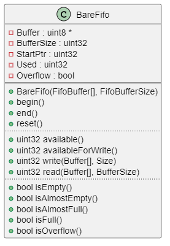
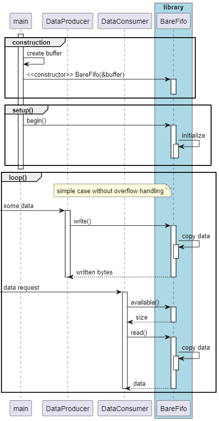
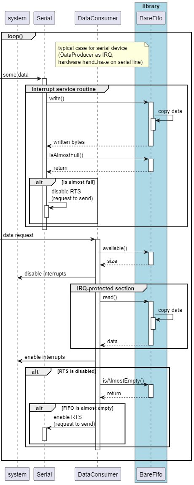

# BareFifo

Generic FIFO class without dynamic memory usage 

## General

The library does not have any dependencies to other libraries except memory.h.

It does not use `new` or `malloc`, so it can be used in an environment where 
dynamic memory allocation is not available (e.g. safety critical environment). 

## Features

* Implemented as C++ class with common Arduino style guide
* Low memory consumption overhead
* Overflow detection: `isOverflow`
* Methods for easy fill level usage: `isEmpty`, `isAlmostEmpty`, 
  `isAlmostFull`, `isFull` 
* Methods for getting the exact fill level: `available` and `availableForWrite`

## Integration

Here the integration of a FiFo is shown with a simple Arduino Sketch:

* include the library

  ```C++
  #include <Arduino.h>
  #include <barefifo.h>
  ```

* create an instance of the class; use a static array as the fifo buffer and hand it over to the fifo class at construction:

  ```C++
  uint8_t FifoBuffer[512];
  BareFifo myFifo(FifoBuffer, sizeof(FifoBuffer));
  ```

## Usage

* setup:

  ```C++
  myFifo.begin();
  ```

* write received data from serial device into the FIFO:

  ```C++
  uint8_t incomingByte = 0;

  if(Serial.available() > 0)
  {
    incomingByte = (uint8_t)Serial.read();
    myFifo.write(incomingByte, 1);
  }
  ```

* read data from the FIFO and printing it on the serial device:

  ```C++
  uint8_t array[256];       // 256 bytes buffer
  uint32_t readBytes = 0;

  if(myFifo.available() > 0)
  {
    readBytes = myFifo.read(array, sizeof(array));
    Serial.write(array, readBytes);
  }
  ```

  :warning: use `noInterrupt()` and `interrupt()` when reading from a FIFO which is filled within an interrupt service routine! 

  ```C++
  uint8_t array[256];       // 256 bytes buffer
  uint32_t readBytes = 0;

  if(myFifo.available() > 0)
  {
    noInterrupts();
    readBytes = myFifo.read(array, sizeof(array));
    interrupts();
    Serial.write(array, readBytes);
  }
  ```


## API

### Setup

* *Constructor*: `BareFifo(uint8_t pu8_FifoBuffer[], const uint32_t u32_FifoBufferSize);`

  An array (`pu8_FifoBuffer`) with the needed size (`u32_FifoBufferSize`) must be handed over at construction.  

* `void begin(void);`

  Resets the FIFO.

* `void end(void);`

  Does nothing - but is available for Arduino style guide conformance and possible future use.

### Operation

* `bool isEmpty(void);`

  Returns `true` if the FIFO is empty, `false` otherwise.

* `bool isAlmostEmpty(void);`

  Returns `true` if the FIFO is filled for less than 20%, `false` otherwise.

* `bool isAlmostFull(void);`

  Returns `true` if the FIFO is filled for more than 80%, `false` otherwise.

* `bool isFull(void);`

  Returns `true` if the FIFO is full, `false` otherwise.

* `bool isOverflow(void);`

  Returns `true` it there was an attempt to write more data to the FIFO than was available for write, `false` otherwise. The overflow flag can only be resetted with the `reset()` method.

* `void reset(void);`

  Clears the FIFO and resets the overflow flag.

* `uint32_t available(void);`

  Returns the number of bytes which are available in the FIFO. 

* `uint32_t availableForWrite(void);`

  Returns the remaining space in the fifo (in bytes).

* `uint32_t write(const uint8_t pu8_Buffer[], const uint32_t u32_Size);`

  Writes the content of `pu8_Buffer` into the FIFO; In case more data are given than space is available in the FIFO, the overflow flag is set. 
  Returns the number of written bytes.

  :warning: when reading from the FIFO within an interrupt service routine, use `noInterrupt()` before and `interrupt()` after writing to the FIFO. 

* `uint32_t read(uint8_t pu8_Buffer[], const uint32_t u32_BufferSize);`

  Reads up to `u32_BufferSize` bytes from the FIFO and writes it into the buffer `pu8_Buffer`. 
  Returns the number of read bytes.

  :warning: when writing into the FIFO within an interrupt service routine, use `noInterrupt()` before and `interrupt()` after reading from the FIFO. 


## Diagrams

### Class Diagram

This diagram illustrates only the BareFifo class. There are no other classes or important structures within this library.



### Sequence Diagram (simple usage)

This sequence diagram illustrates the initialization and the very basic usage. It does not illustrate any error mechanism (FIFO overflow, for example). 



### Sequence Diagram (reading from serial port)

Usually the scenario is more complex. There are several cases, which cannot all be illustrated. 

As an example, the following sequence diagram illustrates the usage for the serial port. Often the serial interface has a hardware buffer of a few byts only, and therefore it is necessary to fetch the incoming data triggered by an interrupt. It often also provides two hardware lines for flow control: RTS (request to send) and CTS (clear to send). The diagram also illustrates how to use RTS in case of an (almost) full FIFO.




## Limitations
                                               
* none


## Known Anomalies

* none


## Changelog

### 1.0.0

* Initial release


## Website

Further information can be found on [GitHub](https://github.com/steftri/barefifo).

